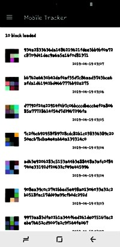
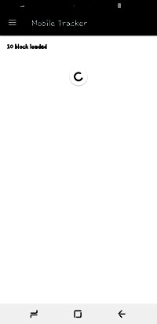
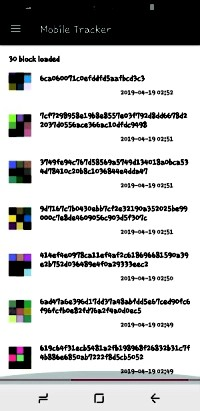
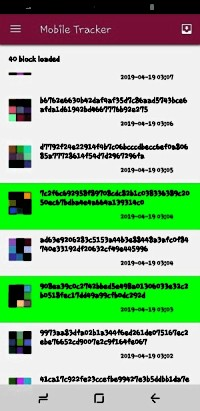
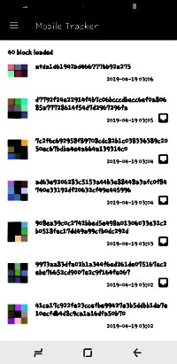
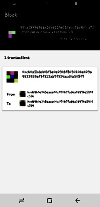

# mobile-tracker

## Requirements
### Scene #1
- ✔ ICON JSON RPC 3.0을 이용하여 가장 마지막에 생성된 10개의 block을 가져오고 화면에 출력합니다.
- ✔ 화면 출력은 내림차순을 기본으로 정렬합니다.
- ✔ 화면 맨 아래에 Pull to refresh를 구현하세요. 마지막으로 가져온 블럭의 다음 블럭부터 10개씩 가져오세요.
- ✔ 각 항목을 표시할 때 block_hash를 title로 사용해주세요.
- ✔ 각 항목은 복수 선택 가능하며 선택된 항목은 DB에 저장할 수 있습니다.

### Scene #2
- ✔ 항목을 선택할 경우 해당 항목의 confirmed_transaction_list의 내용들을 상세히 보여주세요.
- ✔ confirmed_transaction_list의 from, to, txHash를 title로 화면에 출력합니다.

### Scene #3
- ✔ 항목을 선택할 경우 해당 항목의 txHash로 transaction 결과를 받아오고 화면에 출력합니다.

### Scene #4
- ✔ DB에 저장된 내용을 확인합니다.

